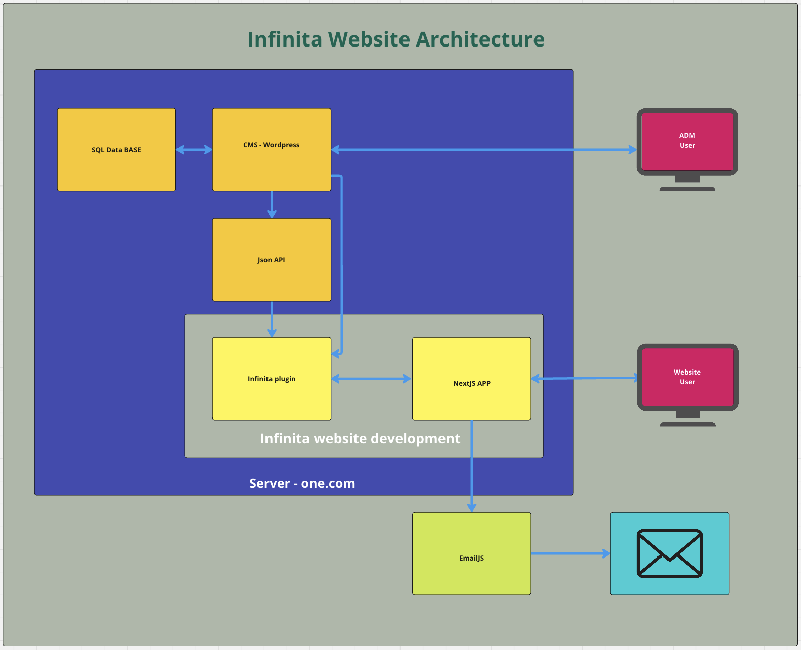

# Infinita Website Documentation

## Background

Infinita Website serves as a portfolio platform for a company deeply involved in the cinema industry. The site, developed by [Adomuka](https://adomuka.com/), showcases the company's varied services, including production, curation, music, and accounting. The primary aim is to exhibit the projects the company has undertaken, attracting potential clients and partners.

## Functional Requirements

1. **Homepage:**
   - Display a carousel featuring four images of the main projects.
   - Showcase the best projects to grab immediate attention.

2. **About Page:**
   - Provide a brief company overview.
   - Include an accordion menu with categories (accounting, curation, music, production).
   - Explain each service under respective categories.

3. **Projects Page:**
   - Exhibit a grid of project images sorted by year.
   - Implement category filters.
   - Link each image to its corresponding project page.

4. **Individual Project Page:**
   - Showcase project poster, description, and video link (if available).
   - Display a gallery of project images (if available).

5. **Services Page:**
   - Detail company services.
   - Utilize an accordion menu to display service locations (Brazil, UK, Europe) with brief descriptions.

6. **Contact Page:**
   - Integrate a contact form for direct communication.
   - Include social media icons in the footer for easy access.

7. **Bilingual Support:**
   - Enable language selection (Portuguese and English) via language buttons (PT/EN).

## Non-functional Requirements

1. **Resilience:**
   - Ensure the site is easily updatable by the client to add new projects.
   - Utilize a CMS (WordPress) for content management.

2. **User Experience:**
   - Provide an intuitive interface with easy navigation.
   - Implement a responsive design for optimal viewing across devices.

3. **Performance:**
   - Optimize image galleries for fast loading times.
   - Minimize server response time by leveraging existing infrastructure.

## Wordpress integration

This app integrates with the Wordpress backend via its REST API. 

A custom plugin was implemented to modify the JSON response to our needs. To work properly, it is necessary to create pages in Wordpress whose slug/permalink match the endpoint's "slug" parameter (see below), otherwise the JSON response will be returned empty.

**Endpoints**:
   - [GET] /wp-json/wp/v2/pages?slug=about 
   - [GET] /wp-json/wp/v2/pages?slug=home-page 
   - [GET] /wp-json/wp/v2/pages?slug=projects 
   - [GET] /wp-json/wp/v2/pages?slug=service

**Plugin location**:
   - Source code: src/lib/wordpress/infinita/custom-json-api-modifications.php
   - Wordpress installation folder: wp-content/plugins/infinita/custom-json-api-modifications.php

**Custom fields**:
   - All endpoints and related Wordpress pages rely on custom fields, created with the ACF plugin. 

##### Featured Image

| **Label**     | **Name**        | **Type**     |
|---------------|-----------------|--------------|
| Title - EN    | title_en        | text         |
| Title - PT    | title_pt        | text         |
| Select image  | featured_img_4  | image        |
| Work          | work_id_4       | post_object  |

##### Português

| **Label**  | **Name**    | **Type**  |
|------------|-------------|-----------|
| Conteúdo   | content_pt  | wysiwyg   |

##### Project

| **Label**                     | **Name**          | **Type**     |
|-------------------------------|-------------------|--------------|
| Title - PT                    | title_pt          | text         |
| Year                          | year              | number       |
| Country - EN                  | country_en        | text         |
| Country - PT                  | country_pt        | text         |
| Image size (in project list)  | image_size        | radio        |
| Image in project list         | image_in_list     | image        |
| Description - EN              | description_en    | wysiwyg      |
| Description - PT              | description_pt    | wysiwyg      |
| Video URL                     | video_en          | url          |
| Image gallery                 | image_gallery     | wysiwyg      |

##### Service

| **Label**                  | **Name**                | **Type**     |
|----------------------------|-------------------------|--------------|
| Service Main Text - EN     | service_main_text_en    | wysiwyg      |
| Service Main Text - PT     | service_main_text_pt    | wysiwyg      |
| Brazil Service Text - EN   | brazil_service_text_en  | wysiwyg      |
| Brazil Service Text - PT   | brazil_service_text_pt  | wysiwyg      |
| UK Service Text - EN       | uk_service_text_en      | wysiwyg      |
| UK Service Text - PT       | uk_service_text_pt      | wysiwyg      |
| Europe Service Text - EN   | europe_service_text_en  | wysiwyg      |
| Europe Service Text - PT   | europe_service_text_pt  | wysiwyg      |
| Brazil Image               | brazil_image            | image        |
| UK Image                   | uk_image                | image        |
| Europe Image               | europe_image            | image        |

## Architecture Diagram

## Tools and Libraries

1. **Typescript, JavaScript, PHP:** Primary programming languages for front-end and back-end development.
2. **SASS, Tailwind:** Used for styling to enhance maintainability and reusability of CSS code.
3. **React, NextJS:** Frameworks for building dynamic and responsive user interfaces.
4. **shad/cn:** Libraries for UI component styling and optimization.
5. **MySQL:** Database management system for storing and retrieving site data.
6. **WordPress:** Content management system for easy content updates.
7. **GitHub:** Version control and project management tool for collaboration and issue tracking.
8. **EmailJS:** Email sending service used in the contact form.

## Contact Form

The contact form uses the EmailJS service to relay outgoing messages.

- website: https://www.emailjs.com
- username: infinita.productions.uk@gmail.com / password: (same as one.com)
- email messages will be sent from a Gmail account: infinita.productions.uk@gmail.com (Gmail password also the same as one.com)

### Change Gmail account
- In EmailJS, go to "Email Services" and connect to a different email service
- The new "service ID" has to be declared in the `.env` file and will be used in the `ContactForm` component

### Change email template
- In EmailJS, go to "Email Templates"
- There you can change the message body, subject, sender and receiver emails, etc
- Dynamic values such as {{message}} have to be declared in the `ContactForm` component, within the `templateParams` object
- In "Email Templates" > "Settings", the displayed template ID has to be declared in the `.env` file

### API keys
- In EmailJS, go to "Account" > "General"
- The "public key" value has to be declared in the `.env` file and used in the `ContactForm` component. The public key will be matched against the account's private key

### Environment variables
- The variables declared in `.env` must be: `NEXT_PUBLIC_EMAILJS_PUBLIC_KEY`, `NEXT_PUBLIC_EMAILJS_SERVICE_ID`, `NEXT_PUBLIC_EMAILJS_TEMPLATE_ID`

## Project Team - Adomuka

### Isolda Liborio
- **Role**: Full Stack Developer and Project Manager
- **GitHub**: [Isolda Liborio](https://github.com/isoldaliborio/)

### Noah Aldhous
- **Role**: Full Stack Developer
- **GitHub**: [NoahAldhous](https://github.com/NoahAldhous)

### Eduardo Di Nardo
- **Role**: Developer Chief
- **GitHub**: [Eduardo Di Nardo](https://github.com/eduardo-haddad)

### Mariana Neri
- **Role**: Designer
- **GitHub**: *([Mariana Neri](https://www.mariananeri.com/))*

## Management

**Agile Methodology:**
- We adopted Agile methodologies for efficient task management, fostering adaptability and collaboration. By breaking tasks into smaller iterations, known as epics and issues, we ensured flexibility in responding to changes and delivering value incrementally.

**Jira Integration:**
- We leveraged Jira as our primary project management tool, facilitating the tracking of tasks, user stories, and sprints. With Jira, we organized our workflow seamlessly, allowing us to visualize progress, manage priorities, and enhance communication within the team.

## Limitations

1. **Content Update Frequency:** Reliance on client updates may result in delays in showcasing new projects.
2. **Performance Dependency:** Performance may vary based on the existing server infrastructure.
3. **Localization Constraints:** Limited language support beyond Portuguese and English.
4. **Security Risks:** Vulnerabilities associated with WordPress plugins and third-party integrations.
